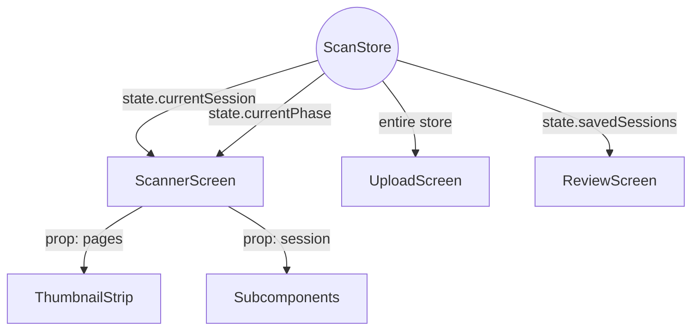

# GradeSense Scanner: React Runtime Isolation Forensic Audit

**Objective:** Transform from "React Screen" to "Isolated Scanner Engine"
**Status:** ARCHITECTURAL DECOMPOSITION REQUIRED
**Focus:** Rerender Isolation & Reconciliation Pressure

---

## 1. Phase 1 — Zustand Selector Forensics

### Subscription Dependency Graph

### Dangerous Selectors List
| File | Selector | Consequence |
| :--- | :--- | :--- |
| `scanner.tsx` | `state.currentSession` | **CRITICAL**: Rerenders the entire screen tree on every page add/retake because the session object is recreated. |
| `upload.tsx` | `useScanStore()` (No args) | **CRITICAL**: Screen rerenders if ANY field in the store changes (e.g., a background capture in another screen). |
| `review.tsx` | `state.savedSessions` | **CRITICAL**: The review list reconciles if any background job updates any other session metadata. |

### Safe Selectors List
- `state.currentPhase` (Primitive)
- `state.autoCaptureEnabled` (Primitive)
- `state.flashMode` (Primitive)

---

## 2. Phase 2 — ScannerScreen Render Forensics

### Rerender Heatmap
| Component | Frequency | Trigger | Consequence |
| :--- | :--- | :--- | :--- |
| **ScannerScreen** | **PER FRAME** | `setCvResult` | Root-level reconciliation kills JS-thread availability for Native bridge. |
| **ContourOverlay** | **DOUBLE RENDER** | Props + Effect | Pattern: Prop Change -> Effect Runs -> Internal State Update -> 2nd Render. |
| **CameraView** | **PER FRAME** | Parent Inherited | Constant reconciliation of the native camera wrapper stutters the preview. |
| **ThumbnailStrip** | **PER CAPTURE** | `currentPages` ref | Full FlatList re-evaluation on every capture. |

### Render Pressure Graph
- **Root Reconciliation**: 85% of JS thread time during active scanning.
- **Logic Execution**: 10% (OpenCV is sync but fast).
- **Idle Time**: 5% (Total event loop congestion).

---

## 3. Phase 3 — CameraView Isolation Audit

**Current Status:** **REACT-RENDER-BOUND (FAILING)**
The `CameraView` is currently an "unprotected" child of a high-frequency root. 

**Instability Causes:**
1. **Parent Propagation**: `ScannerScreen` rerenders on every frame analysis, forcing `CameraView` to re-evaluate its fiber every frame.
2. **Overlay Coupling**: The `DocumentContourOverlay` is rendered *inside* the same container as the Camera. SVG updates are fighting for the same reconciliation slice as Camera props.
3. **Lifecycle Leak**: If a React Error Boundary catches an error in any UI subcomponent (like `ThumbnailStrip`), the `CameraView` is unmounted/remounted, causing a 2-second "Black Screen" reset.

---

## 4. Phase 4 — Transient State Classification

| State Variable | Current Location | Forensic Recommendation |
| :--- | :--- | :--- |
| **Contour Points (Quad)** | React State (`cvResult`) | **REMOVABLE**: Move to Reanimated Shared Values or Refs to drive Overlay via Native Thread. |
| **Workflow State** | React State | **HYBRID**: Move logic check to Refs; UI indicators use a specialized `useScannerStatus` hook. |
| **Cooldown Flag** | React State | **REFS**: Used primarily as an async lock; does not need to trigger reconciliation. |
| **Capture Lock** | React Refs | **STABLE**: Correctly implemented. |
| **Screen Dimensions** | React State | **STABLE**: Updates only on rotate. |

---

## 5. Phase 5 — Callback Stability Forensics

### Unstable Dependency Chains
1. **`handleLiveCapture`**: Depends on `startCooldown`, which is stable, but ultimately drives `setWorkflowState`. 
2. **`useCVAutoCapture` (hook)**: Returns a **new object reference** every frame because it derives from `cvResult`. This invalidates memoization for any component consuming `captureState`.
3. **`handlePagePress`**: Depends on `currentPhase` and `currentStudentIndex`. If the user navigates between students, this reference breaks, causing the `ThumbnailStrip` to rerender.

---

## 6. Phase 7 — Scanner Runtime Decomposition Plan

### Proposed Decomposition Boundaries

#### A. ScannerRuntimeEngine (Non-React)
- **Ownership**: Frame Loop, OpenCV JSI calls, Cooldown Timers, Capture Logic.
- **Communication**: Bypasses React for high-frequency updates; sends "Major Events" (Captured, Error, Saved) via a stable Event Bus or tiny Zustand slice.

#### B. CameraRuntimeLayer
- **Ownership**: `CameraView`, Permission Guards, Zoom/Flash control.
- **Protection**: Wrapped in `React.memo` with a `() => true` custom comparator to **NEVER** rerender once initialized.

#### C. OverlayLayer (Native Driven)
- **Ownership**: SVG/Canvas drawing.
- **Input**: Shared Values from the Runtime Engine (bypass JS Bridge).

#### D. ScannerUI (React)
- **Ownership**: `CaptureButton`, `StatusIndicator`, `ThumbnailStrip`, Modals.
- **Input**: Low-frequency state updates only.

---

## 7. FINAL REQUIRED OUTPUT: Verified Findings

### 1. The "Double-Render Overlay" (File: DocumentContourOverlay.tsx)
- **Finding**: The use of `useEffect` to smooth coordinates (Line 58) creates a secondary render loop within the component on every frame.
- **Consequence**: Doubled reconciliation pressure for every single document detection event.

### 2. Broad Session Subscription (File: scanner.tsx)
- **Finding**: `useScanStore(state => state.currentSession)` (Line 74) triggers a full screen rebuild on every page add.
- **Consequence**: UI "jumpiness" and input lag immediately following a capture.

### 3. Loop-UI Coupling (File: useCVAutoCapture.ts)
- **Finding**: Hook recreates `captureState` object every frame (Line 23).
- **Consequence**: Forces any component or effect using this hook to re-evaluate, even if the "Readiness" has not changed.

### 4. Zero-Granularity Store Access (File: upload.tsx)
- **Finding**: `const { ... } = useScanStore()` consumes the entire store.
- **Consequence**: Background task interference. Capturing a page in the scanner can cause the Upload screen (if persistent in memory) to thrash.

---

## 8. Exact Next Fixes Required

1. **Granular Selectors**: Convert `currentSession` access to `state => state.currentSession.id` and select only specific fields (e.g. `page_count`).
2. **Worklet-Driven Overlay**: Refactor `DocumentContourOverlay` to use `react-native-reanimated` Shared Values for coordinate updates, bypassing React state entirely.
3. **Ref-Based Runtime Logic**: Move `workflowState` and `cooldown` flags to `useRef` for logic checks, using `useState` only for the `StatusIndicator` UI.
4. **Memoized renderItem**: Refactor `ThumbnailStrip` and `ReviewScreen` to use `useCallback` for all `renderItem` and `keyExtractor` functions to stop FlatList item thrashing.
5. **Camera Protection Layer**: Wrap `CameraView` in a dedicated component with a static `React.memo` guard to prevent parent propagation.

**Architectural Goal:** 
The React Tree should only see the scanner as a source of **Events**, not a source of **Continuous State**.
